<script src="https://polyfill.io/v3/polyfill.min.js?features=es6"></script>
<script id="MathJax-script" async src="https://cdn.jsdelivr.net/npm/mathjax@3/es5/tex-mml-chtml.js"></script>
<script type="text/x-mathjax-config">
MathJax.Hub.Config({
  tex2jax: {inlineMath: [['$','$'], ['\\(','\\)']]}
});
</script>
<script type="text/javascript" async src="path-to-mathjax/MathJax.js?config=TeX-AMS_CHTML"></script>

<figure class="image">
  
  <figcaption>{{ include.description }}</figcaption>
</figure>


This is a developer blog detailing engineering projects by Jack Comey.

All work is my own, unless stated otherwise.

For highlights of my work, please [click here](https://drive.google.com/file/d/1oNmdAvaDHDy0yVp10se0VUs5U8sivDb0/view).

Please contact me at jrcomey@ucdavis.edu for any questions.

# Latest Project Updates

These are my latest updates regarding my simulation project. 

---
layout: post
title: Update 8: State-space Implementation and Explanation
excerpt: "Why you should read my website"
tags: [intro, beginner, jekyll, tutorial]
comments: false
category: blog
---

This is a bit of a large update, so bear with me. 




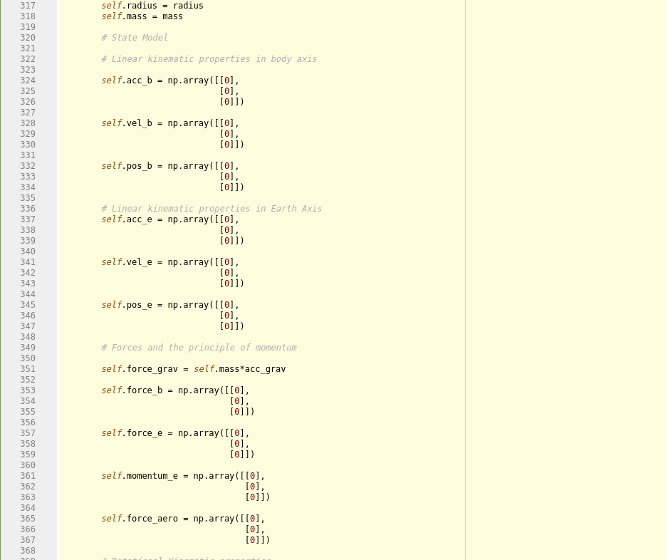
*Old dynamics package: Vectors for translational and rotational motion*

I've been trying to work a state space model into the existing framework of the package, replacing the existing control algorithims and updating the whole structure to accomodate the change. I had almost finished, but the entire module had become so convuluted and difficult to understand that I might as well re-write it. It also didn't work as well, which was the icing on the cake.

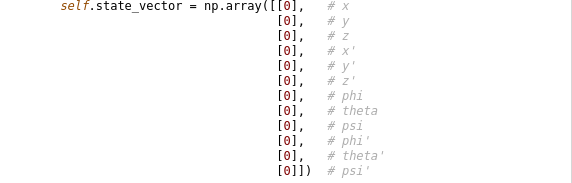
*This state vector model replaces everything in the last photo*


So I re-wrote the whole package. I've completely cleaned up the structure, and the configuration is far simpler, as you can see! Previously, the package consisted of a master UAV object containing the dynamics packages, and multiple child objects with control algorithims specific to a layout (quadcopter, hexacopter, etc). There's only one UAV object, which will not only accomodate any number of motors, but any possible layout, with any possible orientation. I'll explain how that works in a second.

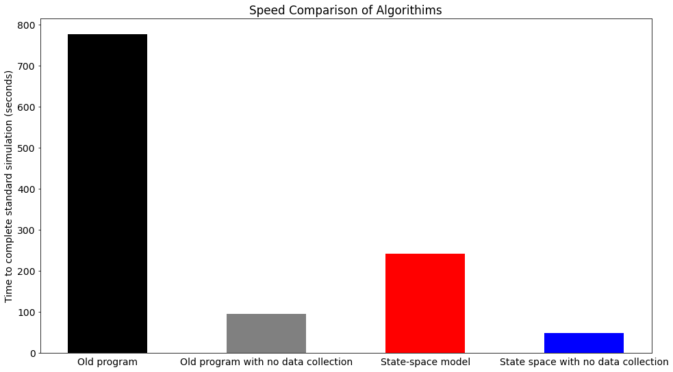
*Compared algorithim speeds*


The results of the re-write, thankfully speak for themselves. For 100 seconds of simulated time at 0.001 second intervals, the old algorithim finishes in 777.02 seconds (~13 minutes). The new state-space based package completes the same task in 4 minutes flat, and improvement of 68.9%. The majority of that time is spent recording flight data, which provides an obvious next step for optimization of the program. Eliminating the recording step in the loop achieves the same task in 48 seconds. 


### Derivation of the Model:

I'll begin with translational motion. The actual model uses 6 degrees of freedom, but the concept is easier to explain with 3x3 matricies instead of 12x12. The derivation is performed with a symmetrical quadcopter, but the model is easily expandable for any number of motors, in any orientation. 

Start with the basic time-variant state-space model:

$$\boldsymbol{\dot{x}}(t) = \boldsymbol{A}(t)x(t) + \boldsymbol{B}(t)\vec{u}(t)$$

$$\boldsymbol{y}(t) = \boldsymbol{C}(t)x(t) + \boldsymbol{D}(t)\vec{u}(t)$$

$\boldsymbol{A}$ and $\boldsymbol{C}$ are straightfoward, and serve to model motion. $\boldsymbol{D}$ is a matrix of zeroes, as there is no feed-forward mechanism.

Each multicopter is controlled through the thrust of each motor. Therefore, the inputs of the system can be defined as a vector containing each motor force:

$$\vec{u} = \begin{bmatrix}F_0\\F_1\\F_2\\F_3\\\end{bmatrix}$$

The problem is that these input forces are in the body frame of reference, and motion calculations are performed in the inertial frame. The solution is to define $\boldsymbol{B}$ so that changes in input forces correctly effect motion in the inertial frame.

Beginning with Newton's second law in the inertial frame of reference, broken into its component parts:

$$\vec{F} = m\vec{a}$$

$$\begin{bmatrix}F_x\\F_y\\ F_z\\\end{bmatrix} = m\begin{bmatrix}a_x\\a_y\\a_z\\\end{bmatrix}$$

Component forces in the body frame can be translated into the inertial frame through rotation matrix $\boldsymbol{R}$

$$\boldsymbol{R}(\psi, \theta, \phi)\begin{bmatrix}{F_x}_b\\{F_y}_b\\{F_z}_b\\\end{bmatrix} = m\begin{bmatrix}a_x\\a_y\\a_z\\\end{bmatrix}$$

These body component forces now need to be defined in terms of motor input forces $\vec{u}$. These can be defined through a motor mixer, which defines the effect of each motor on the component forces:

$$\boldsymbol{R}(\psi, \theta, \phi)\begin{bmatrix}{F_x}_b\\{F_y}_b\\{F_z}_b\\\end{bmatrix} = \boldsymbol{R}(\psi, \theta, \phi)\begin{bmatrix}0 & 0 & 0 & 0\\0 & 0 & 0 & 0\\-1 & -1 & -1 & -1\\\end{bmatrix}\begin{bmatrix}F_0\\F_1\\F_2\\F_3\\\end{bmatrix}$$

Each column defines the effect each motor has on component body forces as a fraction of the total magnitude of the motor force. Each row refers to the component force. Given that the $z$ axis in the body frame points normal to the underside of the aircraft, and the motors are fixed upright on a quadcopter, each motor produces force in the \-z\ direction equal to the magnitude of its total force. 
In the event that a motor is tilted, the mixer can be updated to reflect the effect on the component forces. If the UAV has more motors (e.g. a hexacopter) then the motor mixer will have additional columns corresponding to the number of motors.

The exact same process is repeated with regards to rotational motion, and defines the UAV through local moment forces.

In effect, _any_ UAV layout can be defined in the simulation package with a single motor mixer matrix defining forces and moments on the body. In practial implementation, for a UAV with _**n**_ motors, the aircraft can be _entirely_ defined through a 12x_n_ motor mixer matrix. 

The reverse effect is also true: any desired UAV motion can be defined through the transverse of the motor mixer. 

## Update 8: State-space Implementation and Explanation
_12 SEP 2020_

This is a bit of a large update, so bear with me. 




*Old dynamics package: Vectors for translational and rotational motion*

I've been trying to work a state space model into the existing framework of the package, replacing the existing control algorithims and updating the whole structure to accomodate the change. I had almost finished, but the entire module had become so convuluted and difficult to understand that I might as well re-write it. It also didn't work as well, which was the icing on the cake.


*This state vector model replaces everything in the last photo*


So I re-wrote the whole package. I've completely cleaned up the structure, and the configuration is far simpler, as you can see! Previously, the package consisted of a master UAV object containing the dynamics packages, and multiple child objects with control algorithims specific to a layout (quadcopter, hexacopter, etc). There's only one UAV object, which will not only accomodate any number of motors, but any possible layout, with any possible orientation. I'll explain how that works in a second.


*Compared algorithim speeds*


The results of the re-write, thankfully speak for themselves. For 100 seconds of simulated time at 0.001 second intervals, the old algorithim finishes in 777.02 seconds (~13 minutes). The new state-space based package completes the same task in 4 minutes flat, and improvement of 68.9%. The majority of that time is spent recording flight data, which provides an obvious next step for optimization of the program. Eliminating the recording step in the loop achieves the same task in 48 seconds. 


### Derivation of the Model:

I'll begin with translational motion. The actual model uses 6 degrees of freedom, but the concept is easier to explain with 3x3 matricies instead of 12x12. The derivation is performed with a symmetrical quadcopter, but the model is easily expandable for any number of motors, in any orientation. 

Start with the basic time-variant state-space model:

$$\boldsymbol{\dot{x}}(t) = \boldsymbol{A}(t)x(t) + \boldsymbol{B}(t)\vec{u}(t)$$

$$\boldsymbol{y}(t) = \boldsymbol{C}(t)x(t) + \boldsymbol{D}(t)\vec{u}(t)$$

$\boldsymbol{A}$ and $\boldsymbol{C}$ are straightfoward, and serve to model motion. $\boldsymbol{D}$ is a matrix of zeroes, as there is no feed-forward mechanism.

Each multicopter is controlled through the thrust of each motor. Therefore, the inputs of the system can be defined as a vector containing each motor force:

$$\vec{u} = \begin{bmatrix}F_0\\F_1\\F_2\\F_3\\\end{bmatrix}$$

The problem is that these input forces are in the body frame of reference, and motion calculations are performed in the inertial frame. The solution is to define $\boldsymbol{B}$ so that changes in input forces correctly effect motion in the inertial frame.

Beginning with Newton's second law in the inertial frame of reference, broken into its component parts:

$$\vec{F} = m\vec{a}$$

$$\begin{bmatrix}F_x\\F_y\\ F_z\\\end{bmatrix} = m\begin{bmatrix}a_x\\a_y\\a_z\\\end{bmatrix}$$

Component forces in the body frame can be translated into the inertial frame through rotation matrix $\boldsymbol{R}$

$$\boldsymbol{R}(\psi, \theta, \phi)\begin{bmatrix}{F_x}_b\\{F_y}_b\\{F_z}_b\\\end{bmatrix} = m\begin{bmatrix}a_x\\a_y\\a_z\\\end{bmatrix}$$

These body component forces now need to be defined in terms of motor input forces $\vec{u}$. These can be defined through a motor mixer, which defines the effect of each motor on the component forces:

$$\boldsymbol{R}(\psi, \theta, \phi)\begin{bmatrix}{F_x}_b\\{F_y}_b\\{F_z}_b\\\end{bmatrix} = \boldsymbol{R}(\psi, \theta, \phi)\begin{bmatrix}0 & 0 & 0 & 0\\0 & 0 & 0 & 0\\-1 & -1 & -1 & -1\\\end{bmatrix}\begin{bmatrix}F_0\\F_1\\F_2\\F_3\\\end{bmatrix}$$

Each column defines the effect each motor has on component body forces as a fraction of the total magnitude of the motor force. Each row refers to the component force. Given that the $z$ axis in the body frame points normal to the underside of the aircraft, and the motors are fixed upright on a quadcopter, each motor produces force in the \-z\ direction equal to the magnitude of its total force. 
In the event that a motor is tilted, the mixer can be updated to reflect the effect on the component forces. If the UAV has more motors (e.g. a hexacopter) then the motor mixer will have additional columns corresponding to the number of motors.

The exact same process is repeated with regards to rotational motion, and defines the UAV through local moment forces.

In effect, _any_ UAV layout can be defined in the simulation package with a single motor mixer matrix defining forces and moments on the body. In practial implementation, for a UAV with _**n**_ motors, the aircraft can be _entirely_ defined through a 12x_n_ motor mixer matrix. 

The reverse effect is also true: any desired UAV motion can be defined through the transverse of the motor mixer. 

### Model Implementation:


## Update 7: Cleaning House
_28 AUG 2020_
    
I have spent the last few days restructuring the content of the package to match industry standards. All code is now PEP8 compliant, and the package structure itself now follows standard Python package format. I have also written a readme.md file for the package, which explains what the package is for, why it was made, how to install it, and how to use. I encourage you to read it [here](https://github.com/jrcomey/Simulator). Small portions are placeholders, but will be updated shortly.

I've also taken effort to increase human readability of the package. Each function now has a detailed docstring, and code is broken up into small, easy to read portions, with a comment above explaining what that block does. Variable names are self-explanatory. Here is a sample of the re-written Hover function, which uses a positional PID loop to control UAV altitude as a function of input motor signal:

```python
    def Hover(self):
        """
        Hover function. Uses positional PID control loop to maintain a
        specified altitude.

        Returns
        -------
        None.

        """

        # Feedforward constants. Currently unused.

        setpoint_vel = 0
        setpoint_acc = 0

        # Determination of P, I, and D term values

        err = self.pos_e[2] - self.setpoint_alt
        self.int_pos += err*dt
        der = self.vel_e[2] - setpoint_vel

        # Set motor signal using PID control loop

        self.signal = np.array([[1],
                                [1],
                                [1],
                                [1]]) * int(P * signal_width * err
                                            + I * signal_width * self.int_pos
                                            + D * signal_width * der
                                            + VFF * setpoint_vel
                                            + AFF * setpoint_acc)

        # Check that output signal does not exceed system bounds
        self.SignalCheck()
```

The next goal on the list is to replace the force-summation method with a state space model, and add new analysis functions. I will then consider the package feature complete for my initial goals, and then write extensive documentation to allow others to easily use the package. Once the documentation is complete, I will release the package. After release, I will begin work on simulation of helicopter behaviour, but for now, my initial goal remains to release my current feature list.

## Update 6: Organization and Structure
_24 AUG 2020_

I've made numerous changes since the last update, and I admit that I haven't been making notes with the frequency as I would have liked, primarily due to personal matters.
As it stands now, the simulation package is more or less feature complete according to my initial feature list. It simulates a quadrotor UAV, with the structure to add more formats. The UAV itself operates on multiple PID control loops, and can navigate by way of a waypoint-based autopilot. 

The aim, now, is to restructure the program into a usable Python package, following the advice of Carlos Pereyra, a former TA of mine who has been kind enough to give me advice and direction on this project, and he has encouraged me to pursue publication of this little package. I hope others may find it useful, despite its niche appeal, especially if they find themselves without a testing environment like I did.

To that end, my current goals are as follows:

*	Restructure the current simulation file into a standard Python package format
*	Change the force-summing method currently in use to a state-space model to conform to industry standard
*	Add new analysis functions to return useful engineering data to the user
*	Format any existing code that does not currently meet PEP8 standards, as well as add in-depth comments to allow for human readability
*	Write documentation on all parts of the package to allow others to use it, in as clear and concise a way as possible

## Update 5: Optimization
_30 JUL 2020_

It's been a while since I've posted, but with good reason. While I have very little to speak of for a new feature list, I have made vast improvements to simulation speed. The change with the largest impact was a modification to the way in which aircraft positional data was stored.
Previously, I had been using a pandas data frame which recorded UAV properties at every time step as a new row in the frame. While this was sufficient for short time simulations (<5s), processing time grew much longer as the dataframe increased in size. After 10s of simulated time, the dataframe had reached a size of 10,000 x 22, and time per tick increased from 11ms to >150ms near the end of the simulation, exponentially increasing computation time as the time simulated increased.

With that being said, I've modified the program to use a buffer instead. After the dataframe reaches a pre-determined size, the data is appended to a .csv file for storage. This change drastically reduced computation time, and average time per tick was reduced to 7.2ms. A 40s simulation previously took 53 minutes, and now only takes 7. 

I've also been trying to write the control software to an existing UAV system I have in the hopes of verifying the accuracy of my simulation, but am currently unable to test the aircraft itself. I've also began work on a GUI, in the hopes of distributing a finished version of this simulator to Davis teams that may find it useful.

## Update 4: 3D Positional control and Primitive Autopilot
_14 JUL 2020_

I've been really enjoying working on this simulation project, and never thought that I would make so much progress so quickly. A little under a week ago, all this simulation was capable of was simulating a falling object. Now, it's capable of full 3D positional and attitude control.

Which brings me to the subject of this update. Forces in the Z-direction are mostly dependent on motor thrust, with some influence from the attitude of the aircraft. And yes, while the aircraft _could_ be pointing in any direction, the pitch/roll stabilization functions cause it to level out. Altitude control is fairly easy, as it's simply a function of motor thrust input.

**Image here**

 XY positions, on the other hand, are almost entirely influenced by the _attitude_ of the aircraft, which makes influencing position on that plane a little trickier. Attitude positions in excess of +/- 0.5 pi mean that there is no lift force exerted on the aircraft, and makes it difficult to work with an already existing stabilization function. Instead of trying to override the stabilization function, I made the stabilzation function part of the solution. Attitude control is now influenced by 2 PID loops. The first is a positional PID for the translational axis, and outputs an aircraft angle. That angle is used as the setpoint for the already existing attitude control function. This allows for full 3D control of the aircraft simply by changing setpoints. While not incredibly sophisticated, working positional control into the attitude control loop allows for a primitive form of autopilot. The aircraft now has the ability to move to a entirely random point in 3D space, starting at any velocity and orientation, arrive and remain there, and only requires values for the XYZ coordinates to do so. It may not do so perfectly, but this positional movement control could be applicable for a variety of applications. In physical tests, there would need to be some kind of secondary position-fixing system, such as GPS or an optical system for a known environment to account for increasing IMU drift, but the early stages are promising to say the least.

The next step is to make that basic waypoint system to navigate around generated objects. At first manually placed points, but I plan to use an existing pathfinding algorithim to generate a low resolution path around obstacles. 

On a side note, simulation time is drastically increasing. I hope to begin optimizing the code, but I'd like to finish the waypoint system first. 


## Update 3: PID Positional and Attitude control
_12 JUL 2020_

While velocity control is a good start, the type of system control that you'd want for an autonomous vehicle would be a positional control (e.g. give it an altitude, and it stays steady at that altitude). For that to happen, it was necessary to switch from a velocity based PID control to a position based PID. In practical effects, this just meant a change to the D term as a function of velocity rather than position, as well as the addition of a few feed forward terms. Below is an example of the new behaviour of the system:

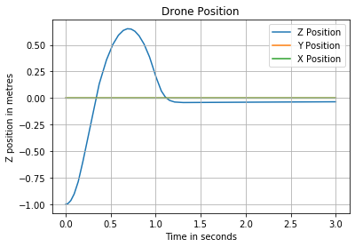

Next comes attitude control. Using the same system, with slightly different constants, its possible to control pitch and roll simulataneously. PID loops for both are seperate, and signal changes to each motor are summed to the current motor signal matrix rather than setting the new signal themselves. This allows them to use the setpoint value for hovering and then modify attitude behaviour as slight differences to each motor from that baseline value. By doing so, both the altitude control and attitude correction funcitons can run simultaneously, with little effect on the other. The first attempt at this is seen below:

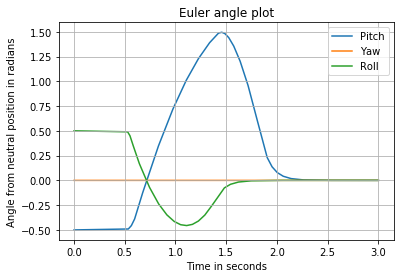
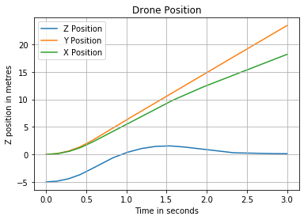

Note that the positional hover takes priority over attitude control, and that attitude control only has room to function after the UAV begins to stabilize at its setpoint altitude. Not only does this prevent attitude control until basic conditions have been met, but prevents the aircraft from self-righting if in an inverted position. The fix to this is to simply call the signal sanity check function at the end of the hover function, to ensure that the signal value that the attitude control functions are being summed with are not beyond the physical bounds of the signal wire itself. This allows the attitude control functions full input at all times, completely fixing the bug. The results of the new system are below.

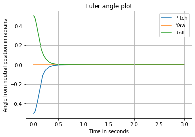
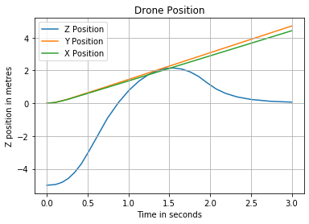

## Update 2: PID Velocity control
_10 JUL 2020_

I wanted to begin PID testing with the translational system as a basic hover function, controlling vertical velocity as the output in the control loop, and motor signal input as the input. Unfortunately, I hadn't had time today to draw up a control systems model for desired behaviour, but the important part for today was to program the actual control loop itself, and worry about desired output behaviour once the system was in place. It's a standard PID loop, nothing particularly special, and I don't think the system itself warrants much explanation.

So far, so good. The simulation seems to be able to achieve a zero velocity condition using the PID loop. The primary issue was unit conversion between velocity and motor signal. My solution to this was to use two constants for each term, one for signal width (defined as the difference between the maximum motor input signal, and the accompanying minimum) and the other for the individual term constant. This is functional for velocity, but early attempts with a setpoint position rather than setpoint velocity yielded an unstable underdamped system. This will require more in-depth analysis, but not until similar control loops for attitude control have been developed.


## Update 1: Physics simulation
_9 JUL 2020_

I'm very pleased to report that the basic physics model for the simulation is now complete. As this is my first post regarding the development process,
this may be a little feature heavy. Bear with me, here.

I'm using a quadcopter model as my test aircraft, but the physics model and other math are applicable to all other formats.

When the aircraft is initialized, all components are defined in a local frame of reference, with its center at the UAV's centre of mass.
All force and torque generation and addition are then done in this localized frame of reference, and then the
combined net force and torque vectors are transformed into a global frame of reference. 
From there, external forces on the aircraft are summed (e.g. gravity)
and then kinematics calculations are performed for a small time interval **dt** for both translational and rotational movement. 

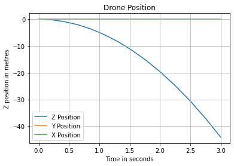

A quick test with no motor input shows that the aircraft falls towards the earth at an accelerating rate, and reaches a predicted position of Z=-44.15m
after three seconds. The next question is if thrust from the motors will stop the aircraft from falling. I wrote a placeholder control loop to increase thrust if the aircraft had negative velocity, and to decrease thrust if the velocity was positive, with the hope that it would reach a point where it would hover.

A successful, if not a very fast responding, demonstration of gravitational and motor forces shows that the translational force and kinematics models are functional.

The rotational model presented more difficulties. I ended up using a deconstructed version of Euler's equations, with an additional function to prevent Euler angles from exceeding bounds. The testing method was similar, and one motor was fixed at maximum power, and then the simulation was run.

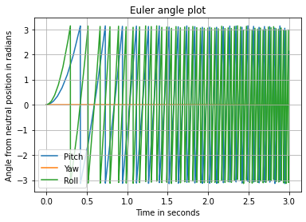

Predictably, the aircraft flips over at an accelerating rate, and begins to spiral. After implementing basic feedback systems for both pitch and roll, these are the results:

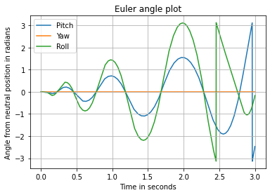

The implemented control system is underdamped and unstable, but is, after all, a placeholder. The next step of the project is to replace this placeholder with a PID controller.

# Project Descriptions

## UAV Simulator Project Description

I've been working on this for a few weeks now, and I was encouraged to keep a development blog and document my process.
 The best place to start, I believe, would be a description of what it is exactly that I'm doing, and how I plan to go about it.

The project itself is a comprehensive UAV simulator (**U**nmanned **A**rial **V**ehicle) designed to be used as an easy testing platform for UAV systems.
While I'm currently developing for multicopter formats (quadcopters, hexacopters etc.), 
I plan on expanding the system for a much larger variety of aircraft in the future.

**Description of overall process here**

The program itself uses a parent class containing general purpose functions and calculations for any generic UAV system. If calculations are 
reliant on specific geometry of the UAV, then those functions are contained in that drone's object class (as a child class of the generic UAV)
This structure allows for easy modelling of wildly different UAV types, with minor edits to the initialization of a new child class, and edits to 
geometry-specific functions.
#### Planned Feature List

*	~~Body, Earth, and Stability transformation matrices for changing vector space~~
*	~~Translational motor thrust modelling~~
*	~~Torque modelling from motor thrust~~
*	Gyroscopic procession modelling for each motor
*	~~Sum of translational motor forces~~
*	~~Sum of motor torques~~
*	~~Model inertia matrix~~
*	~~Hover Capability~~
*	~~Stabilization loop for pitch~~
*	~~Stabilization loop for roll~~
*	~~Stabilization loop for yaw~~
*	~~Above three function together~~
*	~~X velocity kill control~~
*	~~X+Y velocity kill control~~
*	~~Full 3D velocity kill control~~
*	~~Stabilization into velocity kill function~~
*	Seperation of phyiscs calculations and velocity/stabilization program. (Control software loaded onto flight computer)
*	3D pathfinding algorithim to find shortst possible route in 3D space from point A to point B, with maximum acceleration limits.
